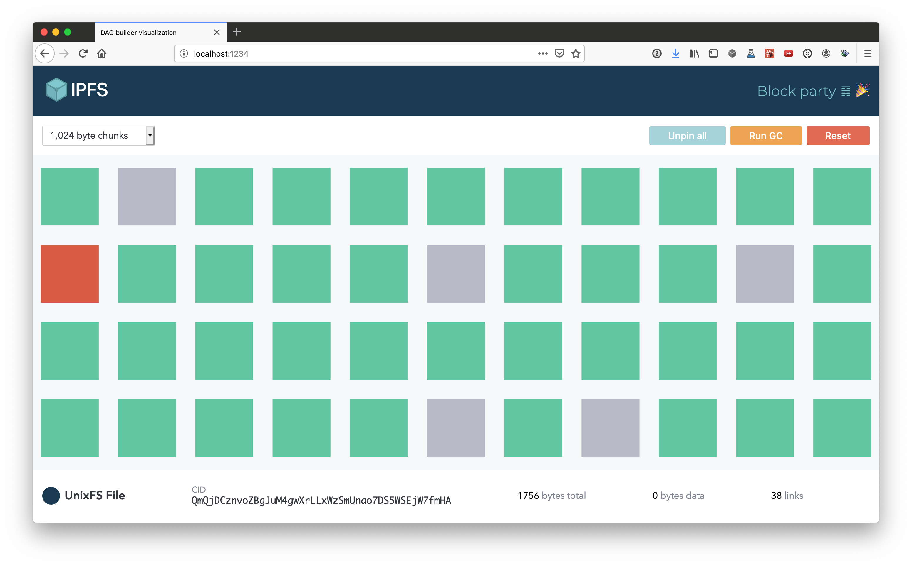

# IPFS block party

> See the blocks in a block store

Drop a file to see it turn into blocks in your local blockstore. Unpin all your blocks, and see them all get deleted when you trigger garbage collection.

